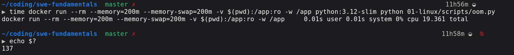
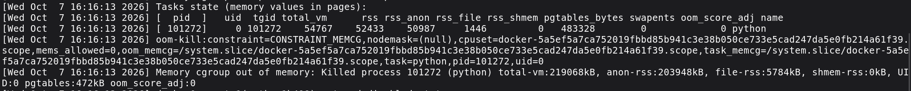
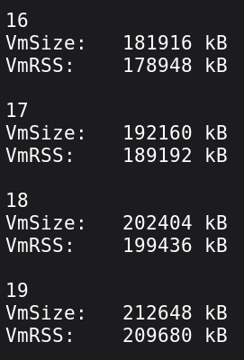
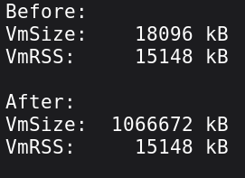
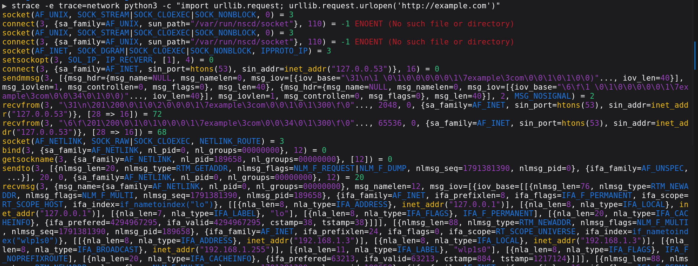

# Container OOM

An Out Of Memory (OOM) kill by appending 10 MiB per second in a container restricted to a 200 MiB memory limit.

## Prediction

* **Duration**: How many seconds should it last? My estimate is 200 / 10 = 20 s. Not all 200 MiB will be available because the Python interpreter itself uses some memory, so approximately 18 s.
* **Exit code**: Since it is an OOM kill with `kill -9` (`SIGKILL`), the exit code is 128 + 9 = 137.
* **`docker stats`**: Memory usage should reach close to the limit.
* **`dmesg`**: Because it is the kernel log, it should contain an OOM event.

## Execution

Code: [`scripts/oom.py`](./scripts/oom.py)

1. Monitor live container resource usage in a separate terminal: `docker stats`
2. Pull the base image: `docker pull python:3.12-slim`
3. Run the container with memory constraints and measure total execution time: `time docker run --rm --memory=200m --memory-swap=200m -v $(pwd):/app:ro -w /app python:3.12-slim python 01-linux/scripts/oom.py`. Since `memory-swap = memory` and hence there is no swap available.
4. Verify the container exit code: `echo $?`

## Results

* Execution output:
  

* Kernel ring buffer log (`dmesg`):
  

* `VmSize` and `VmRSS` printed by the script each second:
  

* Cgroup inspection inside the container:
  ```bash
  ▶ docker run --rm --memory=200m --memory-swap=200m python:3.12-slim bash -c "cat /sys/fs/cgroup/memory.max && echo -- && cat /sys/fs/cgroup/memory.events"
  209715200
  --
  low 0
  high 0
  max 0
  oom 0
  oom_kill 0
  oom_group_kill 0
  sock_throttled 0
  ```

* Output from the `mmap` allocation. Python requested virtual memory from the kernel, but the kernel has not yet allocated physical memory:
  

### Outcome Analysis
* **Total Elapsed Time**: `19.361s` (close to the predicted ~18 s).
* **Exit Code**: `137` (confirming `SIGKILL` / Signal 9).
* **Memory at Kill Event**:
  * `total_vm = 54767 pages`: 54767 x 4 KiB = ~213.9 MiB.
  * `rss = 52433 pages`: 52433 x 4 KiB = ~204.8 MiB.
  * `rss_anon = 50987 pages`: 50987 x 4 KiB = ~199.1 MiB (anonymous memory: Python byte chunks).
  * `rss_file = 1446 pages`: 1446 x 4 KiB = ~5.6 MiB (file-backed memory: Python binary and shared C libraries).
  * `swapents = 0` (no swap used, strictly enforced by `--memory-swap=200m`).

## Learnings

1. **Cgroup Enforcement vs Host Memory**:
   * The container process was killed because it violated its isolated control group ceiling (`CONSTRAINT_MEMCG`), not because the host ran out of physical RAM.
   * `memory.max` in `/sys/fs/cgroup/` directly holds the byte limit: 200 * 1024 * 1024 = 209715200 bytes.

2. **`oom_memcg` vs `task_memcg`**:
   * `oom_memcg`: The cgroup whose memory threshold was breached (`/system.slice/docker-<id>.scope`).
   * `task_memcg`: The specific cgroup path containing the victim process selected to be terminated.
   * Both are identical here because the container is a standalone cgroup with no parent group constraints.

3. **Anonymous RSS vs File RSS**:
   * The kernel differentiates between `rss_anon` (heap/stack memory) and `rss_file` (memory mapped from disk binaries and libraries).
   * File-backed pages can be dropped/reclaimed by the kernel, but anonymous memory cannot be reclaimed without swap.

4. **PID Translation Across Namespaces**:
   * Inside the container's PID namespace, the Python process ran as PID 1.
   * In the host kernel's process table and `dmesg` log, it was tracked with its real host PID (`101272`).

5. **Exit Code Conventions**:
   * Terminations caused by signals produce exit code 128 + N.
   * `SIGKILL` is Signal 9, producing 128 + 9 = 137. `SIGKILL` cannot be caught or blocked by code.

6. **`VmSize` vs `VmRSS` (Virtual vs Physical Memory)**:
   * `VmSize` is the virtual address space mapped in the process's page table.
   * `VmRSS` is the actual physical RAM currently occupied.
   * Writing bytes touches pages, triggering page faults that force the kernel to allocate physical RAM.

7. **Lazy Page Allocation via Anonymous `mmap`**:
   * Allocating memory with `mmap.mmap(-1, size)` reserves address space (`VmSize` jumps by 1 GiB), but commits zero physical RAM (`VmRSS` remains unchanged).
   * The kernel maps unwritten pages to a shared read-only zero page and only allocates physical RAM frames when data is written.

---

# Tracing System Calls with `strace`

Trace system calls during a network HTTP request to observe the boundary between user space and the Linux kernel.

## Execution and Output

`strace -e trace=network python -c "import urllib.request; urllib.request.urlopen('http://example.com')"`



## Learnings

1. **Filtering Syscalls with `-e`**:
   * Without filtering, `strace` dumps thousands of lines of low-level runtime setup (`mmap`, `brk`, `rt_sigaction`).
   * Using `-e trace=network` isolates only socket operations, removing language runtime noise and focusing on external I/O.

2. **Why `trace=file` Produced Massive Verbosity**:
   * Running with `-e trace=file,network` generated hundreds of lines of `newfstatat` and `openat` calls before any network activity started.
   * This is caused by Python's import system: `import urllib.request` systematically scans directories on disk across `sys.path` to find module files and compiled C extensions.

---

# Inspecting File Descriptors in `/proc/<pid>/fd`

Observe how the Linux kernel maps open network sockets and standard streams as file descriptors.

## Execution and Output

1. **Start HTTP server on port 8000**:
   ```text
   python3 -c "import os, http.server; print(os.getpid()); http.server.test(port=8000)"
   151054
   Serving HTTP on 0.0.0.0 port 8000 ...
   ```

2. **Inspect descriptors before client connections**: `ls -l /proc/151054/fd`

   ```text
   lrwx------ 1 pdev pdev 64 Oct  7 18:11 0 -> /dev/pts/1
   lrwx------ 1 pdev pdev 64 Oct  7 18:11 1 -> /dev/pts/1
   lrwx------ 1 pdev pdev 64 Oct  7 18:11 2 -> /dev/pts/1
   lrwx------+1 pdev pdev 64 Oct  7 18:11 3 -> 'socket:[342968]'
   ```

3. **Open 5 concurrent TCP connections from another terminal**: `python3 -c "import socket, time; s = [socket.create_connection(('localhost', 8000)) for _ in range(5)]; time.sleep(60);"`

4. **Inspect descriptors with 5 active connections**: `ls -l /proc/151054/fd`
   ```text
   lrwx------ 1 pdev pdev 64 Oct  7 18:11 0 -> /dev/pts/1
   lrwx------ 1 pdev pdev 64 Oct  7 18:11 1 -> /dev/pts/1
   lrwx------ 1 pdev pdev 64 Oct  7 18:11 2 -> /dev/pts/1
   lrwx------+1 pdev pdev 64 Oct  7 18:11 3 -> 'socket:[342968]'
   lrwx------+1 pdev pdev 64 Oct  7 18:13 4 -> 'socket:[349046]'
   lrwx------+1 pdev pdev 64 Oct  7 18:13 5 -> 'socket:[349047]'
   lrwx------+1 pdev pdev 64 Oct  7 18:13 6 -> 'socket:[349048]'
   lrwx------+1 pdev pdev 64 Oct  7 18:13 7 -> 'socket:[349049]'
   lrwx------+1 pdev pdev 64 Oct  7 18:13 8 -> 'socket:[349050]'
   ```

5. **Check the per-process file descriptor limit**: `ulimit -n` (output: `1024`)

6. **Open more connections than the server's limit**:
   Run the following client in two terminals at the same time (512 connections each): `python3 -c "import socket, time; s = [socket.create_connection(('localhost', 8000)) for _ in range(512)]; time.sleep(60);"`. After about 1024 open sockets, the Python server stopped accepting new connections, though kernel buffers the new connection, not send to python.

   Also, a single client cannot open 1024 connections, because the client process has the same 1024 file descriptor limit. With `range(1024)`, the client failed with the following error:
   ```text
   ▶ python3 -c "import socket, time; s = [socket.create_connection(('localhost', 8000)) for _ in range(1024)]; time.sleep(60);"
   Traceback (most recent call last):
     File "<string>", line 1, in <module>
       import socket, time; s = [socket.create_connection(('localhost', 8000)) for _ in range(1024)]; time.sleep(60);
                                 ~~~~~~~~~~~~~~~~~~~~~~~~^^^^^^^^^^^^^^^^^^^^^
     File "/usr/lib/python3.14/socket.py", line 846, in create_connection
       for res in getaddrinfo(host, port, 0, SOCK_STREAM):
                  ~~~~~~~~~~~^^^^^^^^^^^^^^^^^^^^^^^^^^^^
     File "/usr/lib/python3.14/socket.py", line 983, in getaddrinfo
       for res in _socket.getaddrinfo(host, port, family, type, proto, flags):
                  ~~~~~~~~~~~~~~~~~~~^^^^^^^^^^^^^^^^^^^^^^^^^^^^^^^^^^^^^^^^
   OSError: [Errno 16] Device or resource busy
   ```

## Learnings

1. **Standard Streams (FD 0, 1, 2)**:
   * FDs 0, 1, and 2 represent `stdin`, `stdout`, and `stderr`, all pointing to the pseudo-terminal device `/dev/pts/1`.

2. **Listening Server Socket (FD 3)**:
   * When the HTTP server binds and listens on port 8000, the kernel assigns the lowest available integer (FD 3) pointing to the passive listening socket (`socket:[342968]`).

3. **Accepted Client Sockets (FDs 4 through 8)**:
   * For every client connection accepted by the server, the kernel allocates a new unique integer descriptor (`4, 5, 6, 7, 8`), each pointing to an independent socket inode (`socket:[349046]` through `socket:[349050]`).
   * When a client disconnects, `close(fd)` releases that integer so it can be reused for future connections.

4. **Connection Limits (`ulimit -n`)**:
   * Every open network connection consumes a file descriptor.
   * When the server reaches its file descriptor limit (`ulimit -n`, 1024 here), it cannot accept new connections and the call fails with `EMFILE: Too many open files`. FDs 0 to 3 are already in use, so the server accepts about 1020 client connections.
   * The client has the same 1024 limit. In step 6, the client hit its own limit first, and the error appeared as `Errno 16 Device or resource busy`.

---

# Namespaces by Hand (`unshare`)

Manually create isolated process (PID) and network (NET) namespaces using the Linux kernel's `unshare` command without Docker.

## Execution and Output

1. **Isolating PID and Network Namespaces**: `sudo unshare --pid --fork --mount-proc --net bash`

2. **Inspecting the Isolated Process Table**: `ps aux`
   ```text
   USER         PID %CPU %MEM    VSZ   RSS TTY      STAT START   TIME COMMAND
   root           1  0.0  0.0  10400  4836 pts/6    S    18:58   0:00 bash
   root           7  0.0  0.0  12364  4684 pts/6    R+   18:59   0:00 ps aux
   ```
   * `bash` runs as PID 1.
   * All host processes are completely invisible.

3. **Inspecting the Isolated Network Stack**: `ip addr`
   ```text
   1: lo: <LOOPBACK> mtu 65536 qdisc noop state DOWN group default qlen 1000
       link/loopback 00:00:00:00:00:00 brd 00:00:00:00:00:00
   ```
   * The host WiFi interface (`wlp1s0`) is gone. Only loopback exists and is in the `DOWN` state.

4. **Testing Connectivity**:
   ```bash
   ping 1.1.1.1
   # Output: ping: connect: Network is unreachable
   ```

## Learnings

1. **How `unshare` Operates**:
   * Invokes the kernel's `unshare()` system call so the process stops sharing the selected namespaces with its parent.
   * `--pid`: Creates a private PID namespace (`CLONE_NEWPID`).
   * `--fork`: Required because the calling process cannot change its own PID; it forks a child that enters the new namespace as PID 1.
   * `--mount-proc`: Mounts a fresh, private `/proc` so tools like `ps` query the new namespace instead of the host.
   * `--net`: Creates a private network stack (`CLONE_NEWNET`), detaching from all host network interfaces.

2. **What Docker Adds on Top of `unshare`**:
   * **Virtual Networking**
   * **Root Filesystem Isolation**: Uses OverlayFS to stack image layers and calls `pivot_root` to isolate `/`, preventing access to the host's `/home` and system disks.
   * **Resource Limits (Cgroups)**: Enforces CPU and memory limits under `/sys/fs/cgroup/`, triggering OOM kills when exceeded.
   * **Security Hardening**: Drops dangerous Linux capabilities.
   * **Image Management**: Packaging, distribution, caching, and container lifecycle orchestration.

---

# Docker Image Layers

Deconstruct a Docker image into raw files to inspect its internal structure.

## Execution and Output

1. **Saving Image Archive and Listing Contents**:
   ```bash
   docker save -o img.tar python:3.12-slim
   tar -tf img.tar
   ```
   ```text
   blobs/
   blobs/sha256/
   blobs/sha256/05cda9777409a9c3ffddd94a4c476b79f0769a0b4857f0c7ed9226b6800b0d6f
   blobs/sha256/2b4f19dae3a777dfc3b76730bda1e82e1f66ab2a2686fa93ca78edbfb4f04ffe
   blobs/sha256/46067146ce8ec9b8c20aeb37d41b1d590b0d40d043bd65657df5b319fefaeb64
   blobs/sha256/611ca50ea732877ef8d0c859b502af2f86892e4e80f47bb7c4a9a6f0a5bbb82f
   blobs/sha256/6912e23eb44595b44dc6d9882b34f305ad6f6e9667cec70b13e5dbc4f8cd97f4
   blobs/sha256/75b6a36c64a1cf3520fc4b4aae4739d5caa8a6a05c27835a920a61784c9c32f8
   blobs/sha256/97c6e8c8dabede49976f38493cda88b8a47c34b8e155418663c4f173b9aee414
   blobs/sha256/bbc5a12237474ec0b23b5051260d56d6436a24d70d9cad961adebe7a037ed813
   blobs/sha256/df18428df8a0f9189c84e7424d214b4c50092af1f9dca5842a00c41c39bda316
   blobs/sha256/ecc510c1e359bdc007b39802570bb7e4dec7d6ebccf357c3201a74299113e05e
   blobs/sha256/f83c8037875cdc6506ef83ab2a96a146e212c18156e1e5ccfded74bd13313953
   index.json
   manifest.json
   oci-layout
   ```

2. **Extracting and Inspecting `manifest.json`**:
   ```bash
   tar -xf img.tar
   cat manifest.json
   ```
   ```json
   [
       {
           "Config": "blobs/sha256/df18428df8a0f9189c84e7424d214b4c50092af1f9dca5842a00c41c39bda316",
           "RepoTags": [
               "python:3.12-slim"
           ],
           "Layers": [
               "blobs/sha256/ecc510c1e359bdc007b39802570bb7e4dec7d6ebccf357c3201a74299113e05e",
               "blobs/sha256/75b6a36c64a1cf3520fc4b4aae4739d5caa8a6a05c27835a920a61784c9c32f8",
               "blobs/sha256/6912e23eb44595b44dc6d9882b34f305ad6f6e9667cec70b13e5dbc4f8cd97f4",
               "blobs/sha256/bbc5a12237474ec0b23b5051260d56d6436a24d70d9cad961adebe7a037ed813"
           ]
       }
   ]
   ```

3. **Inspecting Layer Contents (`tar -tf`)**:
   * **Layer 1 (`ecc510c1...`)**: Base Debian slim rootfs
     ```bash
     tar -tf blobs/sha256/ecc510c1e359bdc007b39802570bb7e4dec7d6ebccf357c3201a74299113e05e | head -n 6
     # Output: ./ bin boot/ dev/ etc/ etc/.pwd.lock ...
     ```
   * **Layer 2 (`75b6a36c...`)**: CA certificates and SSL config
     ```bash
     tar -tf blobs/sha256/75b6a36c64a1cf3520fc4b4aae4739d5caa8a6a05c27835a920a61784c9c32f8 | head -n 6
     # Output: etc/ca-certificates/ etc/ssl/certs/ ...
     ```
   * **Layer 3 (`6912e23e...`)**: Shared C runtime libraries
     ```bash
     tar -tf blobs/sha256/6912e23eb44595b44dc6d9882b34f305ad6f6e9667cec70b13e5dbc4f8cd97f4 | head -n 6
     # Output: usr/lib/x86_64-linux-gnu/libffi.so.8 usr/lib/x86_64-linux-gnu/libgdbm.so.6 ...
     ```
   * **Layer 4 (`bbc5a122...`)**: Python runtime and binaries
     ```bash
     tar -tf blobs/sha256/bbc5a12237474ec0b23b5051260d56d6436a24d70d9cad961adebe7a037ed813 | head -n 8
     # Output: usr/local/bin/idle usr/local/bin/pip usr/local/bin/pydoc usr/local/bin/python ...
     ```

4. **Inspecting Container Runtime Configuration**: `python3 -m json.tool blobs/sha256/df18428df8a0f9189c84e7424d214b4c50092af1f9dca5842a00c41c39bda316 | head -n 20`
   * Architecture: `amd64`.
   * Environment variables: `PATH=/usr/local/bin:...`, `LANG=C.UTF-8`, `PYTHON_VERSION=3.12.15`.
   * Default execution command: `Cmd: ["python3"]`.

## Learnings

1. **What a Container Image Actually Is**:
   * A container image is not a disk partition, virtual machine disk image, or compiled binary blob.
   * It is an ordered stack of standard tar archives containing filesystem diffs, bundled with a JSON manifest (`manifest.json`) and a container configuration file (`Config` blob).

2. **Content-Addressable Storage**:
   * Layers and configuration blobs are named by their SHA-256 cryptographic hashes (`blobs/sha256/<hash>`).
   * This allows the container engine to cache layers locally and avoid re-downloading layers shared across different images.

3. **OverlayFS at Container Runtime**:
   * `manifest.json` defines the exact order in which layers are stacked.
   * When Docker pulls an image, it extracts each layer tarball into a directory on disk. When a container starts, the kernel's OverlayFS stacks these directories as read-only lower directories (`lowerdir`).
   * An empty read-write layer (`upperdir`) is mounted on top for runtime changes. Any file modifications made during container execution happen in `upperdir` using copy-on-write, without altering the layer directories.

4. **`tar` Name and Flags**:
   * **Name**: `tar` stands for **T**ape **Ar**chive, originally created in 1979 for streaming files onto magnetic tape drives.
   * **`-f` (`--file`)**: In early Unix, `tar` defaulted to reading and writing directly to physical tape devices. The `-f` flag tells `tar`: *"The very next argument is an archive file on disk, not a tape drive."* Because `-f` takes a filename argument, it must appear right before the filename (`tar -xf <file>` or `tar -tf <file>`).
   * **`-x` (`--extract`)**: Unpacks the archive and writes all contained directories and files to disk.
   * **`-t` (`--list` / Table of Contents)**: Reads the archive headers and streams the file list to stdout without writing a single byte to disk. This allows safe inspection of archive contents before extracting.

---

# Container Signals & Graceful Shutdown (`SIGTERM` vs `SIGKILL`)

Test how Docker handles process signals, measure the difference between catching `SIGTERM` versus ignoring it, and analyze PID 1 signal delivery.

Code: [`scripts/sig.py`](./scripts/sig.py)

## Execution and Output

1. **Handling `SIGTERM` Gracefully**:
   Container running with a custom `signal.SIGTERM` handler (`sig_handle_case()` in the script):
   ```text
   ▶ docker run --rm --name test_sig -v $(pwd):/app:ro -w /app python:3.12-slim python 01-linux/scripts/sig.py
   Waiting for signal...
   Received SIGTERM, shutting down cleanly 15...
   ```

2. **Timing Stop on Graceful Container**:
   ```text
   ▶ time docker stop test_sig
   test_sig
   docker stop test_sig  0.01s user 0.01s system 18% cpu 0.087 total
   ```
   * Result: **0.087 seconds** (immediate graceful exit).

3. **Timing Stop on Container Ignoring `SIGTERM`**:
   Container running with `signal.SIG_IGN` (`sig_ignore_case()` in the script) or with no handler in PID 1:
   ```text
   ▶ time docker stop test_sig
   test_sig
   docker stop test_sig  0.01s user 0.01s system 0% cpu 10.106 total
   ```
   * Result: **10.106 seconds** (timed out waiting for exit, killed by `SIGKILL`).

## Learnings

1. **Signal Lifecycle on `docker stop`**:
   * Docker first issues `kill(pid, SIGTERM)` (Signal 15) to PID 1 inside the container.
   * Docker starts a 10-second grace period.
   * **If the process terminates voluntarily**: Docker immediately cleans up and returns. Total time: ~0.087s.
   * **If the process ignores the signal**: Docker waits out the entire 10 seconds, then issues `kill(pid, SIGKILL)` (Signal 9). The kernel forcefully destroys the process immediately. Total time: ~10.1s.

2. **The `(signum, frame)` Signal Callback Signature**:
   * Python's signal handler protocol requires functions with signature `callback(signum, frame)`.
   * `signum`: Integer code of the signal delivered (`15` for `SIGTERM`).
   * `frame`: The runtime execution **stack frame object** (`types.FrameType`) at the exact instruction that was paused when the signal arrived.

3. **Default Signal Handling for PID 1 in Containers**:
   * **Normal processes (PID > 1)**: An unhandled `SIGTERM` causes immediate termination by default (`SIG_DFL`).
   * **PID 1 in Linux**: The kernel has hardcoded protection for PID 1 to prevent system crashes. If PID 1 does not explicitly register a signal handler, the kernel silently drops `SIGTERM` by default. Even without writing `SIG_IGN`, a vanilla script running as PID 1 will ignore `SIGTERM` and hang for 10 seconds.
   * **Host PID 1 vs Container PID 1**: The real host PID 1 (`systemd`) cannot be killed by any signal, not even `SIGKILL`. Container PID 1 is only PID 1 within its child namespace. The Docker daemon resides in an ancestor namespace on the host and is permitted by the kernel to deliver `SIGKILL` to destroy the container's PID 1 and its namespace.

4. **Zombie Process Accumulation in Running Containers**:
   * When any child process terminates in Linux, its metadata remains in the kernel process table in state `Z` (Zombie / `[defunct]`) until its parent reads its exit status using `wait()` / `waitpid()`.
   * If a parent dies without reaping a child, the kernel re-parents the orphan to **PID 1**.
   * On host Linux, PID 1 (`systemd`) continuously runs an event loop calling `wait()` to reap orphans immediately.
   * Inside a container, your application is PID 1. If it does not implement child reaping, every orphaned child process stays in the process table indefinitely while the container runs. Over days or weeks in production, this exhausts the system PID limit (`pids.max` or `kernel.pid_max`), preventing the container from spawning new processes (`Resource temporarily unavailable`).
   * In production, this is solved by using `docker run --init` or init managers (`tini`, `dumb-init`) to sit at PID 1, forward signals, and reap zombies.

---

# Full Disk & Filesystem Isolation

Create a virtual disk image, inspect loopback block device mounting, understand write exhaustion errors.

## Execution and Output

1. **Allocating and Formatting Virtual Disk**:
   ```bash
   fallocate -l 200M /tmp/disk.img
   mkfs.ext4 /tmp/disk.img
   mkdir -p /mnt/test
   ```
   ```text
   mke2fs 1.47.0 (5-Feb-2023)
   Discarding device blocks: done
   Creating filesystem with 51200 4k blocks and 51200 inodes
   Filesystem UUID: 51720e64-dc2c-4225-91ea-78212a291798
   Allocating group tables: done
   Writing inode tables: done
   Creating journal (4096 blocks): done
   Writing superblocks and filesystem accounting information: done
   ```

2. **Mounting via Loopback Device**: `mount -o loop /tmp/disk.img /mnt/test`
   The file binds to a kernel loop device (`/dev/loopX`) and mounts to `/mnt/test`.

3. **Verifying Filesystem Capacity**: `df -h /mnt/test`

## Learnings

1. **The Loop Device (`-o loop`)**:
   * Disk filesystems such as `ext4` and `xfs` can only be mounted from **block devices** (like `/dev/sda1` or `/dev/nvme0n1p1`), not regular files.
   * A **loop device** (`/dev/loop0`, `/dev/loop1`) is a virtual block device driver in the kernel that acts as a translator: it presents a standard block device interface to `ext4`, while mapping every block read and write into an underlying regular file (`/tmp/disk.img`).
   * `-o loop` tells `mount` bind the file to a free loop device before mounting it.

2. **Disk Full Error Mechanics (`ENOSPC`)**:
   * When a disk runs out of free blocks, the `write()` syscall returns the error code `ENOSPC` (errno 28: No space left on device).
   * In Python, this surfaces as `OSError: [Errno 28] No space left on device`.

### Production Notes

1. **TimescaleDB/PostgreSQL: Dedicated Disk vs Root Disk (`/`)**:
   * **Dedicated Data Disk (e.g., `/var/lib/postgresql/data` mounted on separate volume)**:
     * When the disk reaches 100%, incoming database transactions and write operations fail with `ERROR: could not extend file: No space left on device`.
     * **The operating system remains fully functional**: SSH sessions remain active, `/var/log` continues writing, `/tmp` works, and administrative shells work normally. Administrators can log in, delete old partitions or chunks, drop tables, run `VACUUM`, or expand storage volumes online.
   * **Root Disk (`/`) Exhaustion**:
     * If the database shares the root partition and fills it to 100%, cascading system-wide failure occurs.
     * `systemd-journald` stops writing logs to `/var/log`. It does not crash.
     * Shell sessions cannot record command history or create Unix domain sockets.
     * Administrators are completely locked out of the machine over the network.

2. **Recovery Mechanisms for Full Root Disks**:
   * **Soft Reboot vs Hard Reboot**: A soft reboot (`sudo reboot`) requires shell access. When locked out by a 100% full root disk, a hard reboot (power cycling the hardware or clicking Force Reset in the cloud console) is required.
   * **Single-User Rescue Mode**: Boot with the kernel parameter `systemd.unit=rescue.target` or `init=/bin/bash` in the GRUB bootloader. The kernel boots without starting network or background daemons, dropping straight into a root shell on the physical or serial console to delete bloated files.
   * **Cloud Recovery (AWS EC2)**:
     * **EBS Volume Recovery via Helper Instance**: Stop the broken EC2 instance, detach its root EBS volume, attach it as a secondary data disk to a healthy helper EC2 instance, mount it, delete bloated files, detach, and reattach back to the original instance as the root volume.
