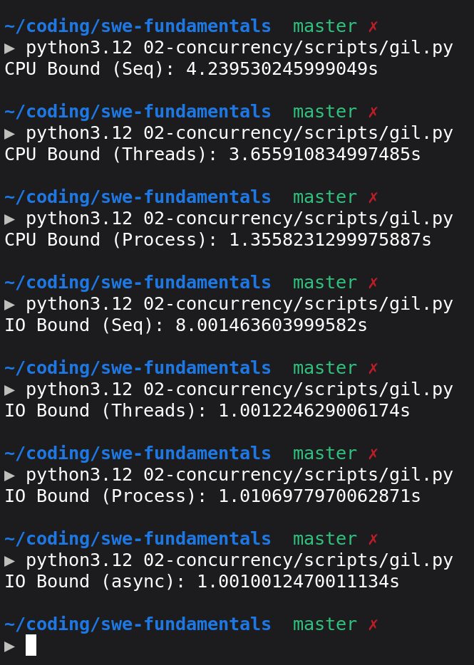

# GIL Timing

Compare execution times of a CPU-bound function and an I/O-bound function run 8 times across sequential, 8 threads, 8 processes, and asyncio modes.

## Prediction

* **CPU-Bound (Sequential)**: Since we are iterating over 10 million and very small arithmetic is involved, around 1 second because the CPU can perform billions of cycles.
* **CPU-Bound (8 Threads)**: Python will not run on two cores at the same time, so threads give no benefit and increase time due to context switching, so a little bit more than the sequential one.
* **CPU-Bound (8 Processes)**: It will take less time as 4 processes can execute simultaneously on 4 cores, approximately 1/4th of the sequential time.
* **I/O-Bound (Sequential)**: A bit more than 8 seconds because `time.sleep(1)` runs sequentially.
* **I/O-Bound (8 Threads)**: 8 threads are submitted and each will start I/O and then the kernel will wake them up; though due to the GIL they cannot all wake up together, roughly over 1 second.
* **I/O-Bound (8 Processes)**: Since it is I/O dependent, processes will not help that much more than threads, so similar to threads (~1 second).
* **I/O-Bound (Asyncio)**: The event loop starts the timer (I/O) and waits for them to finish, so a bit more than 1 second.

## Execution

Code: [scripts/gil.py](./scripts/gil.py)
Run `python3.12 02-concurrency/scripts/gil.py`

## Results

* Execution output:
  

| Workload | Mode | Predicted Time | Actual Time | Speedup vs Sequential |
| :--- | :--- | :--- | :--- | :--- |
| CPU-Bound | Sequential | ~1.0 s | 4.2395 s | 1.00x |
| CPU-Bound | 8 Threads | > Sequential | 3.6559 s | 1.16x |
| CPU-Bound | 8 Processes | ~1/4th (~1.0 s) | 1.3558 s | 3.13x |
| I/O-Bound | Sequential | > 8.0 s | 8.0015 s | 1.00x |
| I/O-Bound | 8 Threads | ~1.0 s | 1.0012 s | 7.99x |
| I/O-Bound | 8 Processes | ~1.0 s | 1.0107 s | 7.92x |
| I/O-Bound | Asyncio | ~1.0 s | 1.0010 s | 7.99x |

### Outcome Analysis

* **CPU-Bound Sequential**: Took 4.2395 s instead of the predicted ~1 s because evaluating 10 million integers in Python bytecode takes ~0.53 s per run, and 8 runs executed in series took ~4.24 s.
* **CPU-Bound Threads**: Took 3.6559 s. The GIL prevented parallel execution across CPU cores, so 8 threads provided no parallel scaling.
* **CPU-Bound Processes**: Took 1.3558 s, giving a 3.13x speedup. Each process ran its own Python interpreter and GIL across physical CPU cores simultaneously.
* **I/O-Bound Workloads**: All three concurrent mechanisms (Threads: 1.0012 s, Processes: 1.0107 s, Asyncio: 1.0010 s) successfully collapsed the 8.0015 s sequential sleep down to ~1.00 s by overlapping the kernel wait time.

## Learnings

* **The GIL restricts CPU-bound threading**: In Python, threading does not scale CPU-bound workloads across multiple cores. True parallel computation requires multi-processing.
* **I/O releases the GIL**: During I/O calls (`time.sleep` or socket operations), CPython explicitly releases the GIL, allowing threads to wait concurrently.

---

# Blocking the Loop

Measure the latency and throughput of sending 10 concurrent requests to a FastAPI application across three endpoint implementations: `async def` with `time.sleep`, `async def` with `await asyncio.sleep`, and plain `def` with `time.sleep`.

## Prediction

* **`block-async` (`async def` with `time.sleep(2)`)**: Since it is an event loop and `time.sleep` is blocking, the entire loop pauses for 2 seconds per hit on this endpoint. With 10 hits, roughly 20 seconds.
* **`nonblock-async` (`async def` with `await asyncio.sleep(2)`)**: Since it is I/O and `await` returns control back to the event loop, the event loop accepts all 10 requests, starts a timer on all of them, and returns responses as they complete; roughly a bit more than 2 seconds.
* **`block-sync` (plain `def` with `time.sleep(2)`)**: In FastAPI, plain `def` runs on a separate thread (with some limit on how many threads spin up). Since it is I/O and threads help start timers simultaneously, a bit more than 2 seconds.

## Execution

Code: [scripts/blocking_server.py](./scripts/blocking_server.py)


```text
▶ docker run --rm -it -v $(pwd):/app:ro -w /app python:3.12-slim bash
root@de459664c7b2:/app# pip install fastapi uvicorn httpx -q
```

1. Start Uvicorn server in container:
   ```bash
   uvicorn blocking_server:app
   ```
2. Run concurrent batch requests from Python client:
   ```python
   from blocking_server import call_apis
   call_apis()
   ```

## Results

* Execution output:
  ```text
  block-async: 20.063724346000527
  nonblock-async: 2.0219305549981073
  block-sync: 2.030086591003055
  ```

| Endpoint | Signature | Predicted Time | Actual Time | Execution Nature |
| :--- | :--- | :--- | :--- | :--- |
| `/block-async` | `async def` + `time.sleep(2)` | ~20 s | 20.0637 s | Serialized (Event loop frozen) |
| `/nonblock-async` | `async def` + `await asyncio.sleep(2)` | ~2 s | 2.0219 s | Concurrent (Event loop timers) |
| `/block-sync` | Plain `def` + `time.sleep(2)` | ~2 s | 2.0301 s | Concurrent (AnyIO worker threads) |

### Outcome Analysis

* **`block-async` (20.0637 s)**: Calling synchronous `time.sleep(2)` inside a coroutine halted Uvicorn's single event loop thread in the Linux kernel. The event loop could not poll `epoll` or accept new requests while asleep, forcing all 10 concurrent requests into strictly sequential execution (10 * 2.0 s ~ 20.06 s).
* **`nonblock-async` (2.0219 s)**: Calling `await asyncio.sleep(2)` yielded control back to the event loop immediately. All 10 requests queued their 2-second timers within milliseconds, and the single thread resumed all 10 coroutines simultaneously when the timers expired.
* **`block-sync` (2.0301 s)**: FastAPI detected that the route was declared as a plain `def` and automatically offloaded execution to an external thread pool (`anyio.to_thread.run_sync()`). All 10 requests executed `time.sleep(2)` in 10 separate worker threads concurrently without freezing the main event loop.

## Learnings

* **Never block the event loop in `async def`**: Calling blocking synchronous functions (like `time.sleep()`, synchronous database drivers, or `requests.get()`) inside an `async def` endpoint stalls the entire application process for all concurrent users.
* **FastAPI plain `def` thread pool protection**: Plain `def` endpoints are safely executed inside AnyIO's `ThreadPoolExecutor` (default 40 threads), isolating synchronous blocking calls from the main event loop thread.

---

# Pool Sizing

Measure execution times of 200 I/O-bound tasks (each sleeping 100 ms) across different thread pool sizes (1, 10, 50, and 200 workers) to observe scaling and diminishing returns.

## Execution

Code: [scripts/pool_sizing.py](./scripts/pool_sizing.py)

```bash
▶ python3.12 02-concurrency/scripts/pool_sizing.py 
1: 20.03219315100432s
10: 2.005197134996706s
50: 0.40439418000460137s
200: 0.11020907100464683s
```

### Outcome Analysis

* **Near-Linear Scaling for I/O**: Because the tasks are purely I/O-bound (`time.sleep(0.1)` releases the GIL), execution scales almost linearly with thread count up to 50 threads.
* **Diminishing Returns in Absolute Wall-Clock Time**:
  * Moving from 1 to 10 workers saved 18.0270 seconds.
  * Moving from 10 to 50 workers saved 1.6008 seconds.
  * Moving from 50 to 200 workers saved only 0.2942 seconds.
* **Resource Trade-offs**: Achieving the final 0.29-second improvement required allocating 150 additional operating system threads, each consuming call stack memory and kernel scheduling overhead. In production systems connecting to external services (like a database), setting thread pool sizes to 200 can overwhelm connection pools or database limits.

## Learnings

* **Thread pools excel at I/O concurrency**: Thread pools scale I/O-bound workloads effectively because threads release the GIL during blocking operations and sleep in the kernel simultaneously.
* **Sizing is bounded by diminishing returns and external limits**: Beyond 50-100 threads, latency improvements flatten significantly while memory and context-switching costs rise.
